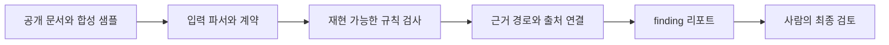

# 공통 설계

세 품질 게이트는 도메인은 다르지만 같은 검증 흐름을 사용합니다.

## 1. 공개 근거로 범위 제한

기업 내부 시스템을 추측해 재현하지 않습니다. 공개 문서에서 확인할 수 있는 필드, 규칙과 표현만 사용하며 확인할 수 없는 기능은 지원 범위에서 제외합니다.

## 2. 생성보다 검증

세 프로젝트는 새로운 답변이나 데이터를 생성하는 제품이 아닙니다. 이미 생성된 답변과 등록 데이터를 검수해 사람이 확인해야 할 위치를 좁히는 도구입니다.

## 3. 결정적 검사와 AI 판단 분리

필수 필드, 숫자 관계, 금지 표현처럼 반복 가능한 항목은 Python 규칙으로 검사합니다. 문맥 판단이 필요한 부분은 Codex 스킬 지침으로 제한하고, 공개 근거와 범위를 함께 전달합니다.

## 4. 근거를 포함한 finding

가능한 모든 finding은 다음 정보를 포함합니다.

- 어떤 입력이 문제인지
- 어떤 규칙에 해당하는지
- 확인할 공개 근거가 무엇인지
- 어떻게 수정하거나 추가 검토할지

## 5. 명시적인 한계

근거가 부족하거나 지원 범위 밖이면 결과를 임의로 통과시키지 않습니다. `BLOCKED`, 검토 신호 또는 미지원 범위로 표시하고 사람의 판단을 남깁니다.

## 6. 테스트

각 프로젝트는 정상 입력뿐 아니라 위반 입력과 손상된 입력을 함께 검사합니다.

| 프로젝트 | 테스트 |
|---|---:|
| Travel Booking Evidence Gate | 9 |
| Commerce Listing Preflight | 17 |
| Investment Answer Gate | 7 |
| 합계 | 33 |
