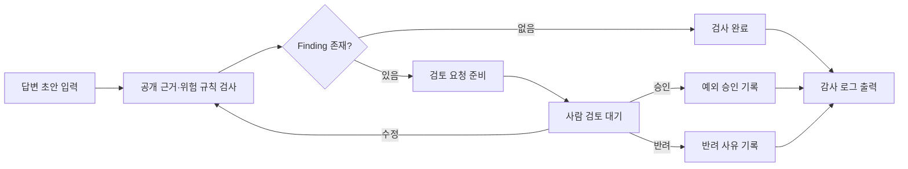

# Investment Answer Review Workflow

금융 안내 답변 초안을 공개 근거 기반 규칙으로 검사하고, 위험 항목이 발견되면 사람의 승인·수정·반려를 기다리는 LangGraph PoC입니다.

> 카카오페이증권의 공식 제품이 아닌 독립 프로토타입입니다. 공개 문서와 합성 데이터만 사용하며 투자 판단, 법률 판단 또는 준법 완료를 수행하지 않습니다.

## Post-hackathon iteration

AX 인재전쟁 제출 버전은 답변 초안을 검사해 finding을 출력하는 로컬 품질 게이트였습니다. 제출 이후 실제 업무 적용을 다시 생각하면서 다음 문제가 남는다고 판단했습니다.

- finding을 누가 확인하는가?
- 검수자가 수정한 답변은 어떻게 다시 검사하는가?
- 위험 항목이 있는데도 승인했다면 그 결정은 어디에 남는가?
- 중단된 검토를 동일한 상태에서 어떻게 이어가는가?

이 확장 버전은 기존 검사기를 바꾸어 포장하지 않고, LangGraph를 이용한 별도 운영 워크플로우를 추가합니다.

| 버전 | 범위 |
|---|---|
| `v0.1` AX 인재전쟁 제출 | 공개 근거 기반 규칙 검사와 finding 출력 |
| `v0.2` Post-hackathon iteration | 상태 분기, 사람 승인, 수정 후 재검사, 감사 기록과 검토 UI |

## 동작 흐름



LangGraph는 흐름을 그리는 도구가 아니라, 이 그래프의 상태·분기·중단·재개를 실제로 실행합니다. `interrupt()`에서 검토를 멈추고 같은 `thread_id`와 체크포인트로 사람의 결정을 받아 이어갑니다.

## 보여주는 역량

- Python과 LangGraph를 이용한 상태 기반 워크플로우
- 기존 품질 게이트를 재사용하는 노드 경계
- Finding 유무에 따른 조건 분기
- `interrupt()`와 체크포인트 기반 Human-in-the-loop
- 승인, 수정, 반려의 명시적인 책임 구분
- 수정본 재검사와 반복 횟수 기록
- 실행 단계와 최종 결정을 남기는 감사 로그
- 검수자가 판단할 수 있는 최소 UI

## 설치

저장소 루트에서 Python 3.12 가상환경을 만드는 예시입니다.

```bash
python3.12 -m venv .venv
source .venv/bin/activate
python -m pip install -r workflows/investment-answer-review/requirements.txt
```

## CLI 데모

위험한 답변을 검사하면 사람의 결정이 필요한 상태에서 멈춥니다.

```bash
PYTHONPATH="gates/investment-answer/src:workflows/investment-answer-review/src" \
python workflows/investment-answer-review/src/review_cli.py run \
  gates/investment-answer/src/examples/bad-answer.md
```

반려 결정을 포함해 한 번에 재현할 수 있습니다.

```bash
PYTHONPATH="gates/investment-answer/src:workflows/investment-answer-review/src" \
python workflows/investment-answer-review/src/review_cli.py run \
  gates/investment-answer/src/examples/bad-answer.md \
  --decision reject \
  --note "단정 표현과 공개 근거를 보완해야 합니다." \
  --audit-out .tmp/investment-review-audit.json
```

수정 후 재검사 흐름은 다음과 같습니다.

```bash
PYTHONPATH="gates/investment-answer/src:workflows/investment-answer-review/src" \
python workflows/investment-answer-review/src/review_cli.py run \
  gates/investment-answer/src/examples/bad-answer.md \
  --decision edit \
  --edited-file gates/investment-answer/src/examples/better-answer.md
```

실제 실행 그래프의 Mermaid 정의도 출력할 수 있습니다.

```bash
PYTHONPATH="gates/investment-answer/src:workflows/investment-answer-review/src" \
python workflows/investment-answer-review/src/review_cli.py diagram
```

## 검토 화면

```bash
PYTHONPATH="gates/investment-answer/src:workflows/investment-answer-review/src" \
streamlit run workflows/investment-answer-review/app.py
```

화면에서는 예제 답변을 불러오고 다음 정보를 확인할 수 있습니다.

- 현재 워크플로우 상태
- Finding 수와 최고 위험도
- finding별 공개 근거와 수정 제안
- 승인, 수정 후 재검사, 반려
- 수정 횟수와 단계별 감사 기록
- 감사 기록 JSON 다운로드

## 테스트

```bash
PYTHONPATH="gates/investment-answer/src:workflows/investment-answer-review/src" \
python -m unittest discover \
  -s workflows/investment-answer-review/tests \
  -v
```

테스트는 다음 흐름을 확인합니다.

1. 안전한 답변은 사람 검토 없이 완료됩니다.
2. 위험한 답변은 검토 단계에서 중단됩니다.
3. 검수자가 finding을 확인하고 예외 승인할 수 있습니다.
4. 검수자가 반려 사유를 남길 수 있습니다.
5. 수정본은 다시 검사되고 통과 결과와 수정 횟수가 기록됩니다.

## 설계 선택

### 답변을 자동으로 고치지 않습니다

이 PoC의 목적은 금융 답변을 생성하는 것이 아니라, 검수 책임과 상태 전환을 명확하게 만드는 것입니다. 수정안 생성 모델을 연결하기 전에 승인 정책, 평가 데이터와 책임 범위를 먼저 검증합니다.

### 규칙 검사와 사람 판단을 분리합니다

금지 표현, 공개 URL과 필수 위험 설명은 기존의 결정적 규칙으로 검사합니다. 예외 승인, 문맥 판단과 실제 운영 반영은 사람이 담당합니다.

### 체크포인트는 데모 범위입니다

현재는 `InMemorySaver`를 사용하므로 프로세스를 종료하면 상태가 사라집니다. 실제 운영 환경에서는 데이터베이스 기반 checkpointer, 사용자 인증, 권한 정책과 감사 로그 저장소가 필요합니다.

## 한계

- 실제 고객 답변이나 비공개 데이터를 사용하지 않습니다.
- 규칙 기반 finding은 법률 또는 준법 판정이 아닙니다.
- 검수 화면은 워크플로우 검증용 PoC이며 운영 권한 체계를 구현하지 않습니다.
- 외부 LLM을 연결하지 않아 답변 생성 또는 자동 수정은 수행하지 않습니다.
- 실제 조직 적용 전에는 평가 데이터셋, 오검출·미검출 분석과 보안 검토가 필요합니다.
